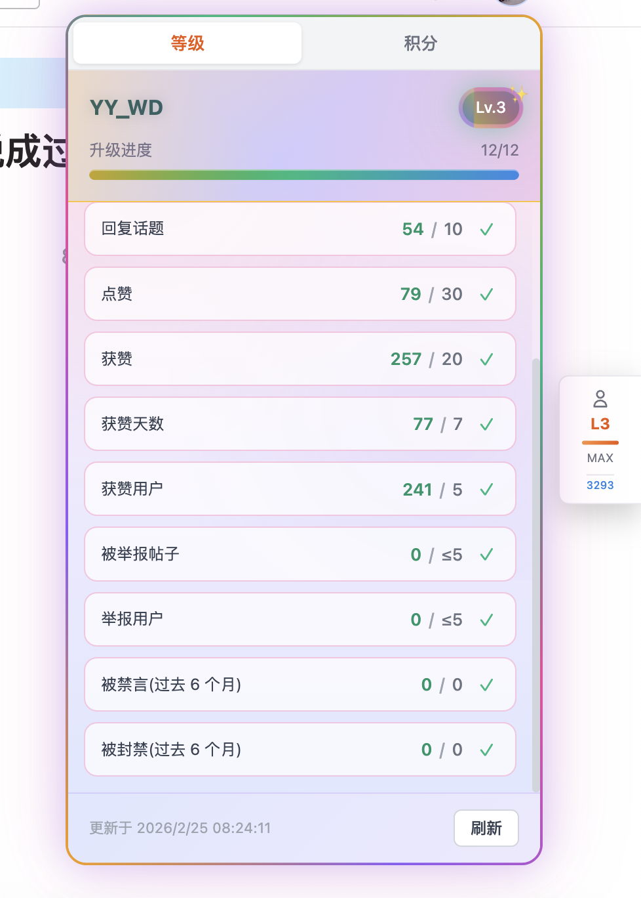
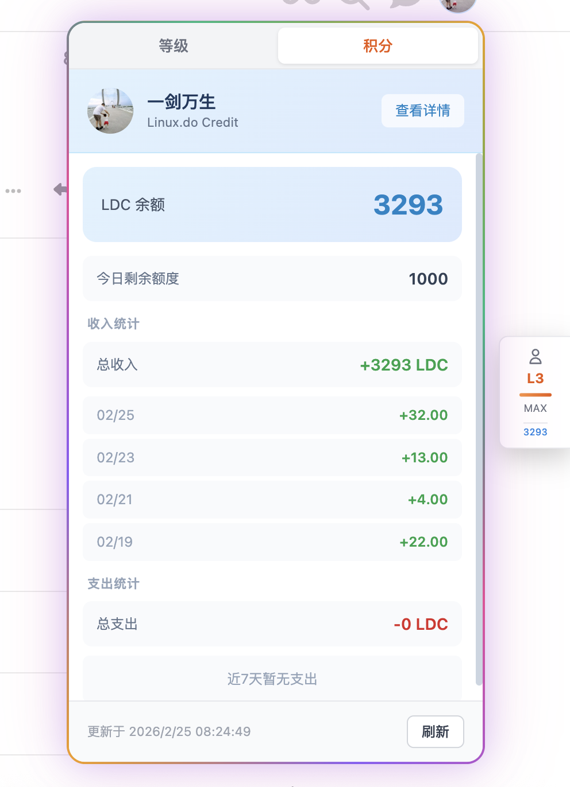
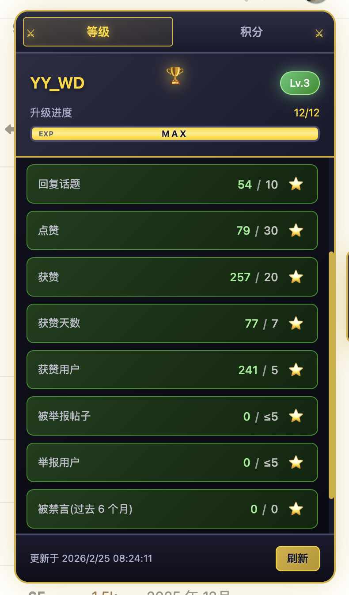
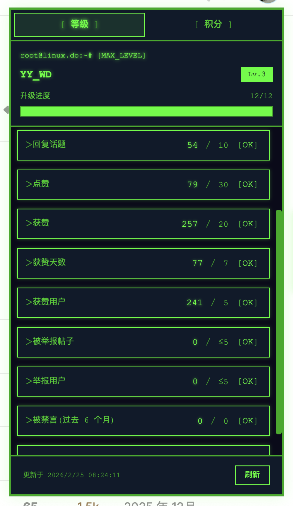
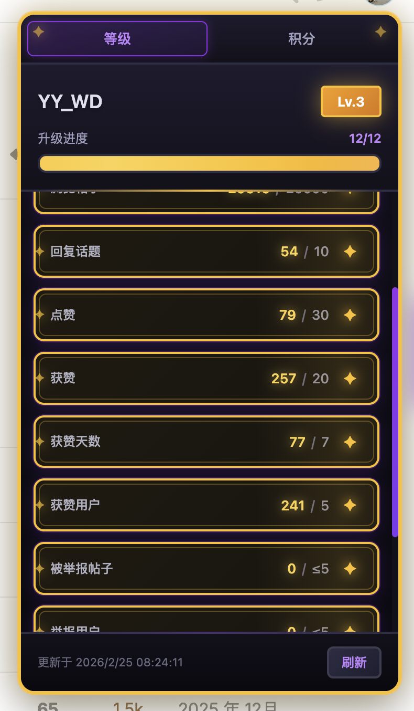
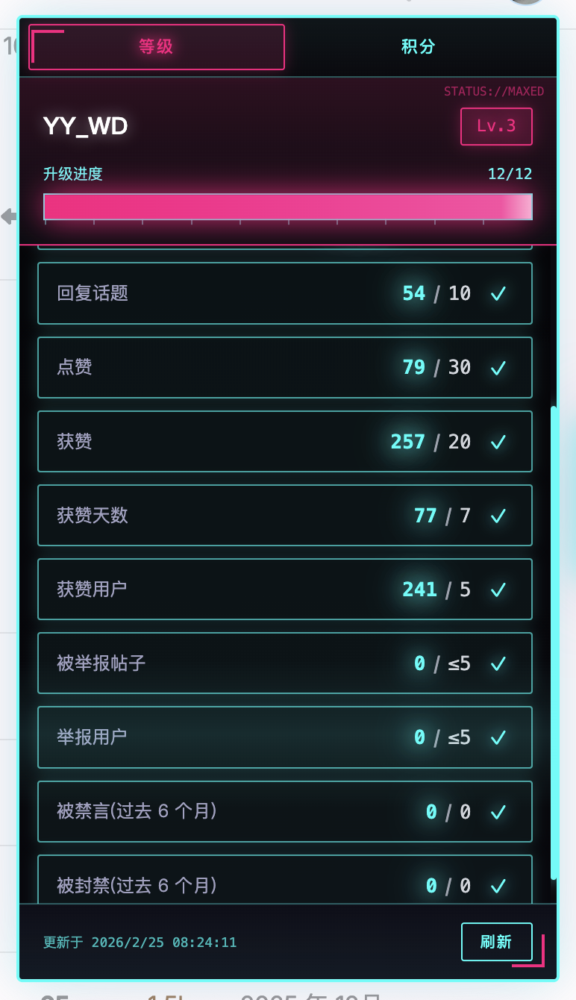

<p align="center">
  
</p>

<h1 align="center">Linux.do 等级监控</h1>

<p align="center">
  <strong>一个优雅的 Chrome 扩展，用于监控 Linux.do 论坛用户信任等级与 Credit 积分</strong>
</p>

<p align="center">
  
  
  
</p>

<p align="center">
  <a href="./README_EN.md">English</a> | 简体中文
</p>

---

## 截图预览

### 等级监控 & Credit 积分

<p align="center">
  
  
</p>
<p align="center">
  <em>左：卡牌主题等级监控面板，逐项展示升级进度 &nbsp;|&nbsp; 右：Credit 积分面板，查看 LDC 余额与近 7 天收支明细</em>
</p>

### 多主题风格

<p align="center">
  
  
  
  
</p>
<p align="center">
  <em>从左到右：⚔️ RPG 主题 &nbsp;|&nbsp; 👾 像素主题 &nbsp;|&nbsp; 🃏 卡牌主题 &nbsp;|&nbsp; 🌆 赛博主题</em>
</p>

---

## 功能特性

### 等级监控
- 实时显示当前信任等级（Lv.0 ~ Lv.3）
- 逐项展示升级所需条件及当前进度
- 支持活跃程度、互动参与、合规记录等多维度指标
- 满级自动识别与庆祝动画

### Credit 积分集成
- LDC 余额实时显示
- 今日剩余额度查询
- 近 7 天收支统计与明细
- 用户头像与昵称展示

### 5 种游戏主题

| 主题 | 风格 |
|------|------|
| 🎨 **默认** | 现代简约，橙色渐变 |
| ⚔️ **RPG** | 中世纪奇幻，金色调 |
| 👾 **像素** | 终端复古，CRT 屏幕感 |
| 🃏 **卡牌** | 集换式卡牌，宝石装饰 |
| 🌆 **赛博** | 赛博朋克，霓虹灯效 |

### 其他
- 浮窗悬停自动展开，离开自动收起
- 等级 / 积分双标签页，记忆上次选择
- 智能缓存（等级 1 小时，积分 30 分钟）
- 账号切换自动清除缓存
- Popup 弹窗快速切换主题

## 安装方式

### 从源码安装（开发者模式）

1. 克隆本仓库

```bash
git clone https://github.com/njyaoyao2019/linuxdo-level-monitor.git
```

2. 打开 Chrome，访问 `chrome://extensions/`
3. 开启右上角 **开发者模式**
4. 点击 **加载已解压的扩展程序**
5. 选择项目中的 `chrome-extension` 文件夹

## 使用方法

1. 访问 [linux.do](https://linux.do)，页面右侧会自动出现浮窗按钮
2. **鼠标悬停** 浮窗按钮，弹出详细等级/积分信息
3. **点击浮窗按钮** 可切换主题风格
4. 点击工具栏扩展图标，可在 Popup 中快速选择主题

## 项目结构

```
chrome-extension/
├── manifest.json          # 扩展配置（Manifest V3）
├── background.js          # Background Service Worker，处理跨域请求
├── content.js             # Content Script，核心业务逻辑
├── popup/
│   ├── popup.html         # Popup 弹窗页面
│   ├── popup.js           # Popup 逻辑
│   └── popup.css          # Popup 样式
├── themes/
│   ├── base.css           # 基础样式
│   ├── rpg.css            # RPG 主题
│   ├── pixel.css          # 像素主题
│   ├── card.css           # 卡牌主题
│   └── cyber.css          # 赛博主题
└── icons/
    ├── icon16.png
    ├── icon48.png
    └── icon128.png
```

## 技术架构

```
┌─ Popup (popup/)
│  └─ 主题选择 & 版本显示
│
├─ Content Script (content.js)
│  ├─ 页面 DOM 注入浮窗
│  ├─ 等级数据解析（connect.linux.do / summary.json）
│  ├─ Credit 积分获取（credit.linux.do API）
│  └─ UI 交互 & 主题切换
│
└─ Background Service Worker (background.js)
   └─ 跨域请求代理（携带 Cookie）
```

**数据来源**

| 数据 | 来源 | 说明 |
|------|------|------|
| 2-3 级等级进度 | `connect.linux.do` | 解析 HTML 页面中的进度条和数值 |
| 0-1 级等级进度 | `linux.do/u/{user}/summary.json` | Discourse API，需携带 CSRF Token |
| Credit 积分 | `credit.linux.do/api/v1/*` | RESTful JSON API |

## 权限说明

| 权限 | 用途 |
|------|------|
| `storage` | 本地存储主题偏好、缓存数据 |
| `activeTab` | 获取当前标签页信息 |
| `https://linux.do/*` | 访问论坛页面，获取 CSRF Token 和 summary 数据 |
| `https://connect.linux.do/*` | 获取用户等级进度信息 |
| `https://credit.linux.do/*` | 获取 Credit 积分数据 |

## 等级要求参考

### Lv.0 → Lv.1

| 条件 | 要求 |
|------|------|
| 浏览的话题 | 5 |
| 已读帖子 | 30 |
| 阅读时间 | 10 分钟 |

### Lv.1 → Lv.2

| 条件 | 要求 |
|------|------|
| 访问天数 | 15 |
| 给出的赞 | 1 |
| 收到的赞 | 1 |
| 帖子数量 | 3 |
| 浏览的话题 | 20 |
| 已读帖子 | 100 |
| 阅读时间 | 60 分钟 |

> Lv.2 → Lv.3 的要求由 `connect.linux.do` 页面动态展示。

## 许可证

[MIT License](./LICENSE)

## 作者

**YaoYao**
